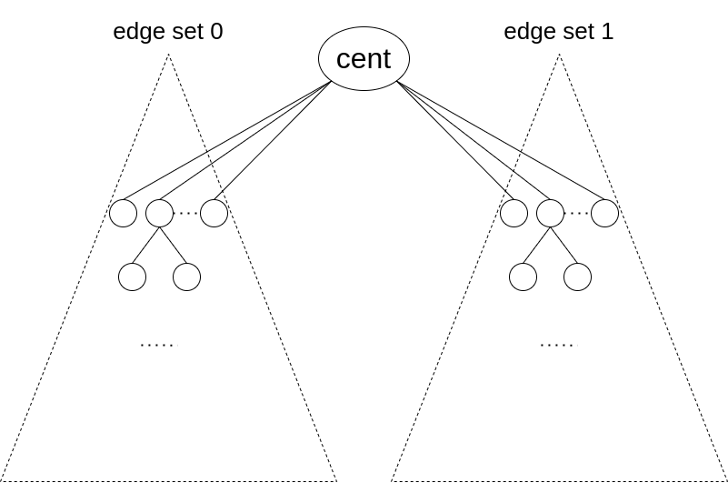

## explanation of the greedy

think "my edge set", and "the other edge set"

### the problem

`3 * (sum + sub_sz[v]) <= 2 * (siz - 1)` is the greedy from https://codeforces.com/blog/entry/104997 but for example once my edge set has more than half the edges (e.g. `2 * sum >= siz - 1`) we potentially can still add to it, making the edge sets even more "unbalanced".

### the fix

define balance = `abs(size_of_my_edge_set - size_of_other_edge_set)`

- before adding `sub_sz[v]`, balance = `abs(sum - (siz - 1 - sum))`
- after adding `sub_sz[v]`, balance = `abs(sum + sub_sz[v] - (siz - 1 - sum - sub_sz[v]))`

idea: we want to add `v` to my edge set only when that decreases the balance (and my edge set's size stays <= 2/3(siz-1)).

How to see that `2 * sum + sub_sz[v] < siz - 1` is the same as "adding `sub_sz[v]` to my edge set will decrease the balance"?

rewrite as `sum + sub_sz[v] < siz - 1 - sum`, now:

- `sum + sub_sz[v]` = size of my edge set after adding `v`
- `siz - 1 - sum` = size of the other edge set before adding `v`

so we only add `sub_sz[v]` to my edge set when my edge set afterwards is smaller than the other edge set before.

---

## Will this greedy always give a 1/3-2/3 partition? 

It is clear `3*sum <= 2*(siz-1)` so we just have to show `3*sum >= siz-1` (at the end):

- if size of my edge set so far `<1/3(siz-1)` then the behavior of this greedy is exactly the same as the one in the blog
- if size of my edge set so far `>=1/3(siz-1)` then we switch the behavior to "only add if the balance decreases"
