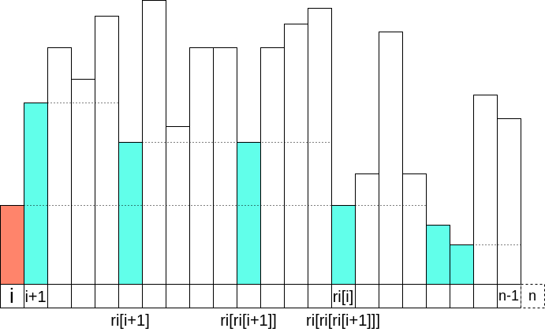
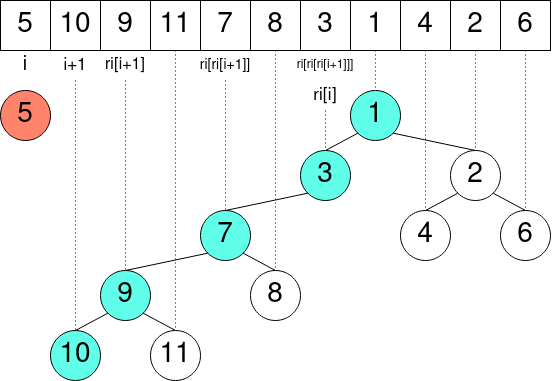
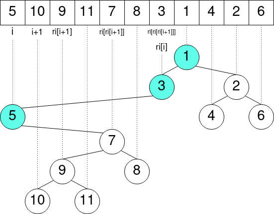

all images are when you pass in `less` for `cmp`:

For cartesian binary tree, if you reverse the direction of the outer `i`-loop,
    then it can be thought of as building the cartesian tree for each suffix.
    Then the inner `j` loop can be thought of as looping up the stack of blue nodes:

